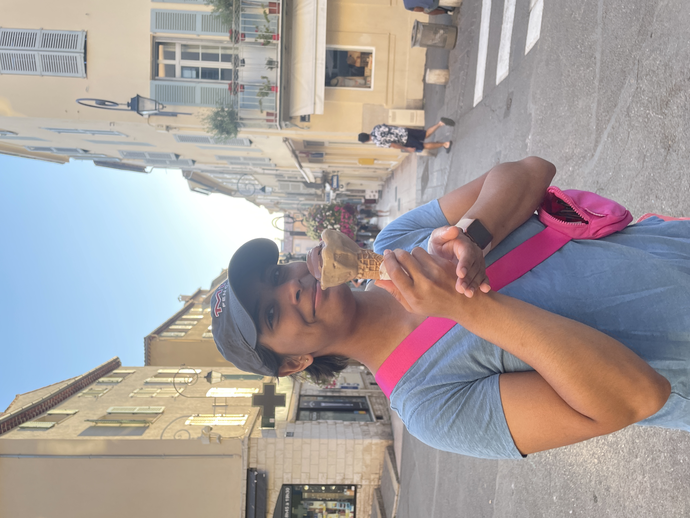

<h1> About Me </h1>

</img>

Hi! My name is Rhea. I'm a senior from Washington, DC studying course 6-3 with minors in history and French. I am looking forward to learning more about using design to improve user experience.

<h2> FAQ </h2>

<b> Question? </b> 
<i> Lorem ipsum odor amet, consectetuer adipiscing elit. Platea dui maximus dictumst volutpat sollicitudin nostra facilisi dis. Ante morbi felis augue nunc eros at? Dictumst scelerisque inceptos praesent consequat habitant nec ornare id amet.  </i> 

<b> Another question? </b> 
<i> Lorem ipsum odor amet, consectetuer adipiscing elit. Accumsan magnis dignissim facilisis, pulvinar laoreet ex eu. Tristique natoque faucibus metus vitae accumsan turpis id hendrerit. Luctus leo odio potenti; platea vestibulum fusce.</i>

<b> A third question? </b> 
<i> Lorem ipsum odor amet, consectetuer adipiscing elit. Nibh duis nulla finibus sociosqu pretium.</i>

<footer>

Questions? Email me at rhea@mit.edu

</footer>