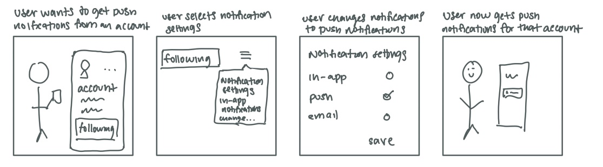

# Assignment 2: Divergent Design

## Application Goals

**Name**: Updates

**Audience**: People who currently do not use social media platforms because they want more control over what they see and what other people see about them.

**Value**: This app will allow users to have more flexibility with the online persona they wish to create. In addition to controlling what content they can see, a user can control who sees the content they create.

## Comparables
<table style="text-align:center">
<tbody>
<tr>
    <td><a href="https://archetype-cheddartv-prod.web.arc-cdn.net/resizer/v2/JFXGE42OJNYUG3ZUJVQVQ6KYNJ.jpg?auth=cb5707a50e7e41d8269c6d982d7aa78e13bcc77980ae728fc085fe6cf926dc02&width=1924&height=4167
    ">Image source</a>  Verifying identity before sending someone money on Venmo: can have some type of verification of an account’s identity before following them.</td>
    <td>   Separate apps for Uber drivers and Uber riders: could have separate experiences for creating content and consuming content </td>
    <td>   Sharing an image to people via Whatsapp: apply this to selecting people to share a post with</td>
</tr>
<tr>
    <td>   Adding multimedia to Facebook posts: allow different types of content in app posts (text, video, img, embeds)</td>
    <td>   Piazza collective answer space (also seen on Twitter): have a feature allowing collaboration on a post or on responses to a post?</td>
    <td>   Tumblr tagging system for organizing posts: could implement a similar tagging convention for better filtering</td>
</tr>
<tr>
    <td>   Control over Youtube subscription notifications: apply this control to notifications of new content, different settings for different people?</td>
    <td>   Adding additional accounts on Instagram such as a Finsta/spam account: could have a feature to share content with select people instead of having different accounts</td>
    <td>   Inviting people to edit a Google docs: could use this idea to invite users to collaborate on posts</td>
</tr>
</tbody>
</table>

## Feature Brainstorming

- **Account separation**: Have different accounts/user interfaces for content consuming and content producing. Users who do not wish to publish content and instead just want to receive it would only create a “consumer” account with features focused on controlling what a user sees. Users who wish to produce content would get an experience with features that make it easier to manage what they create.
- **Connection separation**: Allow different levels of connecting with other users. Can “subscribe” to an account for content notifications such as receiving updates whenever that person posts. Users can also have closer “friends” with additional levels of communication such as receiving more personalized posts and direct messages. 
- **Custom audiences**: Post content to different groups of people. Users control who sees a post with high levels of specificity, beyond restricting posts to followers vs the general public. A user can grant specific other users the ability to see a post e.g. a specific group of friends. 
- **[Idea from friend] Tag modifiers**: Tag posts with the intended audience. This can go beyond just groups (like followers-only or family-only) and also share a post with groups in the general public. For example, tagging a post with the level of detail: “biology (not in depth)” for a post about seeing a frog on a walk vs “biology (in depth)” to signify a new article on CRISPR technology.
- **[Idea from friend] Mood filters**: A user can filter the content they see based on the mood that they are in. If the user is sad, they can toggle a filter to only see content that would cheer them up.
- **Anonymous posting**: A user could choose to post anonymously to a topic or tag. If a user has a post that does not fit with the “brand” they wish to create, they could still share it. Users could also post anonymously to a group of followers or other users. This feature would require some level of content moderation to also maintain internet safety.
- **Post sharing controls**: Users can decide whether other users can share a post of theirs. Also add some level of granularity, such as a post only being able to be shared with other followers, or only visible to a certain degree of separation (e.g. only followers of followers).
- **Post visibility modification**: Allow users to modify a posts’ visibility on the fly, for example adding users who can view a post. Also schedule changes in the future, like an expiration date or an expansion (e.g. only visible to one group for 24 hours before becoming visible to all followers).
Control profile visibility: Hide certain aspects of a profile from different groups. For categories such as follower count, profile bio, and profile picture, control whether that aspect can be seen by the general public, by followers only, by specific followers, etc. Can also display different information to different groups, such as different profile bios for the general public vs for followers.
- **No subscriber count**: Under a subscriber model, where users “subscribe” to an account to get notified if there are updates, accounts would not store the subscriber count. Both the account owner and other users would not be able to see the users subscribed or the overall number of users subscribed.
- **Post reaction control**: The user can choose whether a post can be liked/upvoted/etc. The user has the option to manage this setting for different groups of people (following vs not following) and over different stretches of time (eg only the first 24 hours).
- **Group users into groups**: For better control of content sharing, group users (such as followers) into different groups. For example, a user could have a group for close friends, family members, coworkers, etc. and share different content to those different groups. When posting content, a user would have the option to select which groups would be able to see and interact with the post.
- **View with link**: Another method of post sharing. A user can mark a post private except to people who have a link to the post. The link gives access; people who do not use the link will not be able to access the post. 
- **Add content to existing posts**: Users can add supplemental content to a post. Users can also choose who can see the content they add to the note (general public, only followers, only people they share the post with, etc.)
- **Choose notifications**: Set different notification settings for different accounts or different user groups. A user can get email or push notifications if certain accounts publish content and just get in-app notifications for other accounts.
- **Verify users**: Ensure that you know a person before following them. When trying to follow a person, a user will have to ask that person for a code or something similar to make sure they are following the correct person, and to ensure that person wants the user to follow them.
- **Account highlights**: An account bio will have a highlight overview of that account, for example a text or image summary, which explains how that account interacts with other topics a user might be interested in. This would help a user determine if they want to follow/subscribe to an unknown account.
- **Time limit**: A user can post content which disappears after a certain amount of time or a certain amount of views, for example a post that can only be seen once per day.
- **Specific blocking settings**: A user provides reasons for blocking or hiding another account. This would be used to ensure that content similar to what was blocked would not be shown to the user again. 
- **Geolocation posts**: Only share posts with users located in a specific region. Users can also control whether or not they share their location, making them able to opt in or out of using this feature.  
- **[Idea from ChatGPT] Visibility history**: A user can see a timeline of who has viewed a post and can also have the ability to revoke access to certain people on that timeline. 
- **[Idea from ChatGPT] Approval before viewing a post**: A user can mark a post such that a follower needs to get that user’s approval before viewing that post.
- **[Idea from ChatGPT] Sharing notifications**: Notify a user when another user shares their content. The user has the option to approve or deny the share based on the other viewer’s audience group.

## VSD Analysis

**Stakeholders; prompt: variation in human ability**. The feature of selecting a subset of users to share content with would be complicated to do one-handed, especially if the feature involves selecting buttons on a screen or typing a name into a search box. A better design would have a simpler user selection process, for instance having larger icons for commonly-used groups.

**Stakeholders; prompt: changing hands**. The feature of grouping followers into specific groups makes each account extremely personal. If the account were to change hands, modifying each group would be time consuming. A response to this would be a mass group editor widget which gives the user the ability to add and remove multiple followers to and from multiple groups. 

**Time; prompt: sustained friendships**. This app could make it easier to sustain multiple friend groups by allowing personalized posts for different people. By the same logic, however, the same feature could make it easier to divide friend groups. One potential response is limiting the number of personalized posts to aim to prevent the formation of cliques.

**Pervasiveness; prompt: political realities**. Anonymous posting would be received differently in a democratic vs authoritarian political climate. Anonymous posting is more accepted in a democratic environment, but both climates can weaponize anonymous posting for political purposes. A possible way to avoid this is to implement a form of partial anonymity where anonymous posts are shown to others anonymously but are still linked to an account.

**Values; prompt: choose desired values**. This app values control and autonomy, using features such as posting to groups and tag filtering to ensure that users can present themselves as they wish to different people. The app values privacy with its features of different visibility settings for different post features. Finally, the app values inclusivity for providing a platform that many different types of users can use.

## Storyboards

Posting to a select group of people 

Creating a group

Recieving push notifications from a specific account

