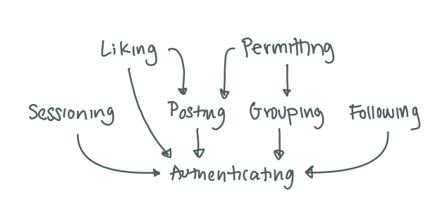

# Assignment 3: Convergent Design

## Pitch

*Updates* is an app for people who want to connect with other people while at the same time having more control over their online image. Users can present different content to different audiences, so they do not have to be concerned with maintaining one single persona for their account. Users follow other accounts to see the content posted by those accounts. Instead of receiving all the content posted by those accounts, however, the user only sees the content those accounts want the user to see. A user groups their followers: the user can create one group of close friends, another group of family, and a third group of coworkers. The user then has the ability to deliver different content to different groups by selecting which groups can view and which groups can react to the content that user posts. A user could post vacation updates to all their followers, but only allow their family to react. That user could also post an inside joke that only their close friends can see and react to. With these features, users create the online space that they want to experience, sharing *updates* with their friends.

## Concepts

*Authenticating, Sessioning, Posting inspired by lecture examples*

```
concept Authenticating
purpose connect app accounts to the people using the app
principle after creating a username and password, as long as that username/password combination has not been deleted, a person using the app will be authenticated if they provide that same username/password combination
state
	created: set Account
	username, password: created → one String
actions
	create(username, password: String, out account: Account)
		add username and password to created 
	authenticate(username, password: String, out account: Account)
		return an account if its username/password combination matches
	delete(account: Account)
		delete account from created
```

```
concept Session-ing[Account]
purpose allow a user’s account to be authenticated for a long period of time
principle after a session begins for an account, as long as that session has not ended, the same account will be retrieved
state
	active: set Session
	account: active → one Account
actions
    start (account: Account, out session: Session) 
        add a new session for the account to active
    retrieveAccount (session: Session, out account: Account) 
        return the account associated with that session
    end (session: Session)
        remove the session from active 
```

```
concept Posting[Account]
purpose users can share content with other users
principle after creating a post, until that post is deleted, that post will be returned by getPosts
state
	posted: set Post
	content: Post → one String
	author: Post → one Account
actions
	create(account: Account, content: String, out Post)
		create a new post and add it to posted
	delete(post: Post)
		remove a post from posted
    getPosts(posts: out Post)
        return posted
```

```
concept Following[Account]
purpose users can connect with other users of the app
principle when an account follows another account, the isFollowing will return true as long as the first account does not unfollow the second account and getFollowers(second account) will include the first account
state
	follows: set Follow
	user: Follow → one Account
	followers: Follow → set Account
actions
	follow(follower: Account, target: Account, out follow: Follow)
		if target is a user, add follower to set of followers
		else create new follow and add to follows
	unfollow(follower: Account, target: Account)
		remove follower from set of followers with user target
	isFollowing(follower: Account, target: Account, out isFollowing: bool)
		returns true if follower is in followers for user target in follow
		otherwise returns false
    getFollowers(user: Account, out follower: set Account)
        returns the followers for a user
```

```
concept Grouping[Account]
purpose users can group together accounts to add or restrict permissions for that group
principle when a group is created, until that group is deleted, a new account added to that group will remain in that group until that account is removed from that group
state
	groups: set Group
    name: groups → one String
	accounts: groups → set Account
	creator: groups → one Account

actions
	create(name: String, creator: Account, out group: Group)
		add empty group to groups
	delete(creator: Account, group: Group)
		remove group from groups
	add(account: Account, group: Group, out newGroup: Group)
		add account to group
	remove(account: Account, group: Group, out newGroup: Group)
		remove account from group
```

```
concept Liking[Post, Account]
purpose users can react positively to a post
principle when a post is liked by an account, that post will remain liked until it is unliked
state
	liked: set Like
	targetPost: Like → one Post
	likedBy: Like → one Account
actions
	like(post: Post, account: Account, out like: Like)
		add new like to liked
	unlike(like: Like)
		remove like from liked
```

```
concept Permitting[Post, Group]
purpose permit the account to view or like a post
principle when a permission on a group and post exists, until that permission is removed, for that group and post canView will return true if view is true and canLike will return true if like is true
state
	permissions: set Permission
	group: Permission → one Group
    post: Permission → one Post
    view: Permission → one Bool
    like: Permission → one Bool
actions
	create(group: Group, post: Post, view: bool, like: bool, out permission: Permission)
		add new permission to permissions
	remove(permission: Permission)
		remove permission from permissions
	canView(group: Group, post: Post, out allowed: bool)
		returns true if view is true for the Permission with the Group and Post
		returns false otherwise
    canLike(group: Group, post: Post, out allowed: bool)
		returns true if like is true for the Permission with the Group and Post
		returns false otherwise
```

## Synchronizations

```
app Updates
	include Authenticating, Session-ing[Authenticating.Account], Posting[Authenticating.Account], Following[Authenticating.Account], Grouping[Authenticating.Account], Liking[Posting.Post, Authenticating.Account], Permitting[Grouping.Group, Posting.Post]

	sync register(username, password: String, out account: Account)
        Authenticating.register(username, password, account)

    sync login(username, password: String, out account: Account, out session: Session) 
        Authenticating.authenticate (username, password, account) 
        Sessioning.start(account, session)

    sync authenticate(session: Session, out account: Account)
        Sessioning.retrieveAccount(session, account)

    sync logout(session: Session)
        Sessioning.end(session)

    sync addFollower(session: Session, target: Account, out follow: Follow)
        Sessioning.retrieveAccount(session, account)
        Following.follow(account, target, follow)

    sync removeFollower(session: Session, target: Account)
        Sessioning.retrieveAccount(session, account)
        Following.unfollow(account, target)

    sync getFollowers(session: Session, out followers: set Account)
        Sessioning.retrieveAccount(session, account)
        Following.getFollowers(account)

	sync createGroup(session: Session, name: String, targets: set Account, out group: Group)
		Sessioning.retrieveAccount(session, account)
		Grouping.create(name, group)
		for target in targets:
			if Following.isFollowing(account, target, isFollowing)
	            Grouping.add(target, group, group)

	sync deleteGroup(session: Session, group: Group)
		Sessioning.retrieveAccount(session, account)
		if account == group.creator:
			Grouping.delete(group)

	sync addFollowersToGroup(session: Session, targets: set Account, group: Group, out newGroup: Group)
		Sessioning.retrieveAccount(session, account)
		Following.isFollowing(account, target, isFollowing)
		if account == group.creator for target in targets:
			Grouping.add(target, group, newGroup)

    sync removeFromGroup(session: Session, target: Account, group: Group, out newGroup: Group)
        Sessioning.retrieveAccount(session, account)
        if account == group.creator:
            Grouping.remove(target, group, newGroup: Group)

	sync createPost(session: Session, content: String, permissions: set (Group, view, like), out post: Post)
		Sessioning.retrieveAccount(session, account)
        Posting.create(account, content, post)
        for permission in permissions:
			Permitting.create(permission.Group, post, permission.view, permission.like)

	sync deletePost(post: Post)
		Posting.delete(post)

	sync viewPosts(group: Group, out posts: set Post):
		Posting.getPosts(posts).filter(post: Post → Permitting.canView(group, post, allowed))
			
    sync likePost(group: Group, posts: Post, out like: Like):
            if Permitting.canLike(group, post, allowed):
                Liking.like(post, account, like)

	sync unlikePost(like: Like):
		Liking.unlike(like)
```

## Dependency diagram




## Wireframes

[Figma link](https://www.figma.com/design/dKPVtzp8kSOgGuriHr6EWJ/assignment-3?node-id=0-1&t=kGLq8f7V6lZxzcG1-1)

## Design Tradeoffs

**Don’t think**: One feature the app includes is reacting to user comments. I considered several iterations of this feature, and in the end had three options: emoji reacts, user comments, or getting rid of the response altogether. I rejected the last option because I want the app to provide connection between people and did not want an app that just had users scream into an empty void. Between commenting and reacting, I chose reactions because I want the poster to have control over their content and reacting is less imposition on the post than commenting.

**Good vibes only**: Once I decided on reacting, I needed to decide which reactions to include. I had a bunch of choices, inspired by other emoji reactions: thumbs up, hearts, various faces. I could have also included the entire emoji library. In the end, I chose to only have a “like” feature. I made this decision to reduce complexity in the design, avoiding the need to keep track of several different reactions. I chose to keep the like feature because it is a simple way to react to posts while keeping the emotions largely positive, for a better user experience. 

**Is anyone out there**: One feature I debated including is a search feature. I ended up not including the feature in the app. The purpose of this search feature would have been to find other users to follow. I mostly chose to not include this feature because it would have added too much complexity to a proof of concept. I would probably include this feature in a more developed app, because I feel it would be necessary to include when the number of users grows too much to simply list them.