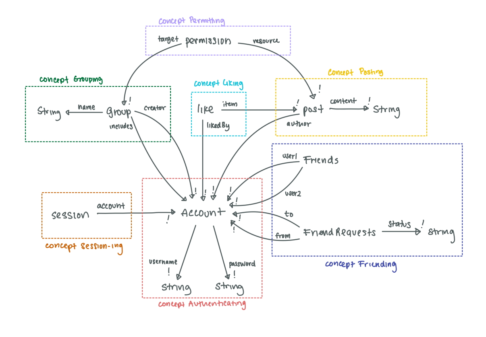

# Assignment 4: Backend Design & Implementation (Alpha)

## Abstract Data Models

```
concept Authenticating
state
	created: set Account
	username: created → one String
	password: created → one String
```

```
concept Session-ing[Account]
state
	active: set Session
	account: active → one Account
```

```
concept Posting[Account]
state
	posted: set Post
	author: Post → one Account
	content: Post → one String
```

```
concept Friending[Account]
state
	friends: set Friends
	user1: Friends → one Account
	user2: Friends → one Account
	
	requests: set FriendRequests
	from: requests → one Account
	to: requests → one Account
	status: requests → one {"rejected", "pending", "accepted"}
```

```
concept Grouping[Account]
state
	groups: set Group
name: groups → one String
	creator: groups → one Account
	includes: groups → set Account
```

```
concept Liking[Post, Account]
state
	liked: set Like
	post: Like → one Post
	likedBy: Like → one Account
```

```
concept Permitting[Group, Post]
state
	permissions: set Permission
	groups: Permission → one Group
    post: Permission → one Post
    view: Permission → one Bool
    like: Permission → one Bool
```

## App Definition

```
app Updates
	include Authenticating, Session-ing[Authenticating.Account], Posting[Authenticating.Account], Friending[Authenticating.Account], Grouping[Authenticating.Account], Liking[Posting.Post, Authenticating.Account], Permitting[Grouping.Group, Posting.Post]
```

## Dependency Diagram



## Code Repository

Link: [https://github.com/bhattacharjee-rhea/a4-backend](https://github.com/bhattacharjee-rhea/a4-backend)

## Deployed Service

Link: [https://a4-backend-tau.vercel.app/](https://a4-backend-tau.vercel.app/)
