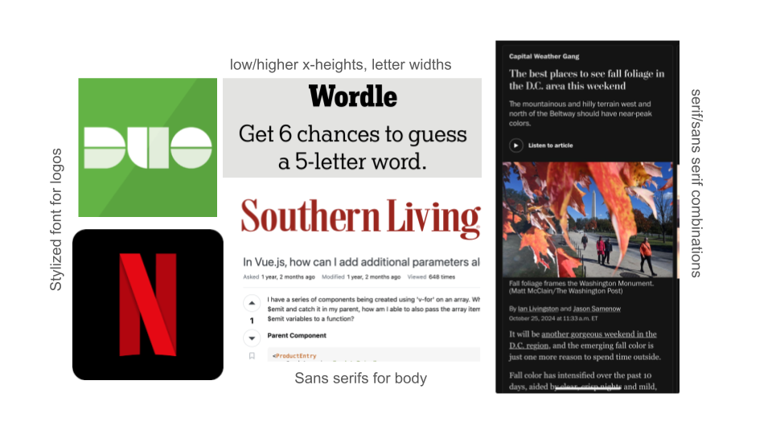

# Assignment 5: Frontend Design & Implementation (Beta)

## Heuristic Evaluation

**Usability criteria**

*Discoverability*: how rapidly and easily can users understand how to operate the interface?
- Clear buttons for most major operations (e.g. creating a post clearly walks through the steps of doing so)
- Icons at the bottom are not the most clear (followers and following in different sections, what is the difference between one icon and two?)
- Above largely a tradeoff of space at the bottom vs understandability, but in any case can try to rework the sections so related topics (followers and following) are together

*Error tolerance*: how easily can a user recover from making mistakes?
- Every creation action has a deletion action, can delete a created post or created group
- Making a mistake when allocating permissions would require re-creating the entire permission group (can be hard to recover)
- No way to recover from accidentally deleting a post or group → tradeoff with complexity, but could introduce a two-step deletion process to make sure it doesn’t happen by accident

**Physical heuristics**

*Gestalt principles*: does the layout of the interface elements convey conceptual structure?
- Posts are laid out in a row, consider whether this order should be chronological or not
- Followers and groups are placed together, while following is placed in a separate category, follower/following concepts are more similar and might benefit from being placed together. Tradeoff that grouping is closely related to followers, since groups are made of followers. Will have to structure app to preserve this relation while preserving follower/following similarity as well.
- New post content and permissions are separated, which is a good way to separate their functions

*Mapping*: does the layout of the interface elements match their function?
- Navigation tab at the bottom (fits well with the mobile app design)
- Similar layouts for adding and deleting group members and permissions, which works well with the similar functions
- Some big actions (e.g. new post) are at the top of the page while some (e.g. create post) are at the bottom. Does the consistency of this work or should they match? Tradeoff of understandability (create button after inputs) vs consistency 

**Linguistic level**

*Speak a user’s language*: does the interface use simple, helpful informative messages? are there instances where messages might only be understandable by developers?
- Most novel actions have some explanation (e.g. create group, follow someone)
- Basic actions have common images (heart for like, pencil for edit, trash can for delete)
- Icons at the bottom might not be the most clear (what is the difference between one icon and two?)
- Function of the app implies preexisting understanding of the underlying mechanism 

*Consistency*: does the interface reuse the same names, symbols, and icons for the same concepts or actions? how consistent is the interface with others across the same application domain or platform?
- Consistent icons for liking (heart), editing (pencil), and deleting (trash can) which tend to be the same across other digital designs
- Inconsistent use of plus signs for creating— follow button uses a plus sign but create group does not

## Visual Design Study

## Code Repository

Link: [https://github.com/bhattacharjee-rhea/a5-frontend](https://github.com/bhattacharjee-rhea/a5-frontend)

## Deployed Frontend

Link: [https://a5-frontend-alpha.vercel.app/](https://a5-frontend-alpha.vercel.app/)